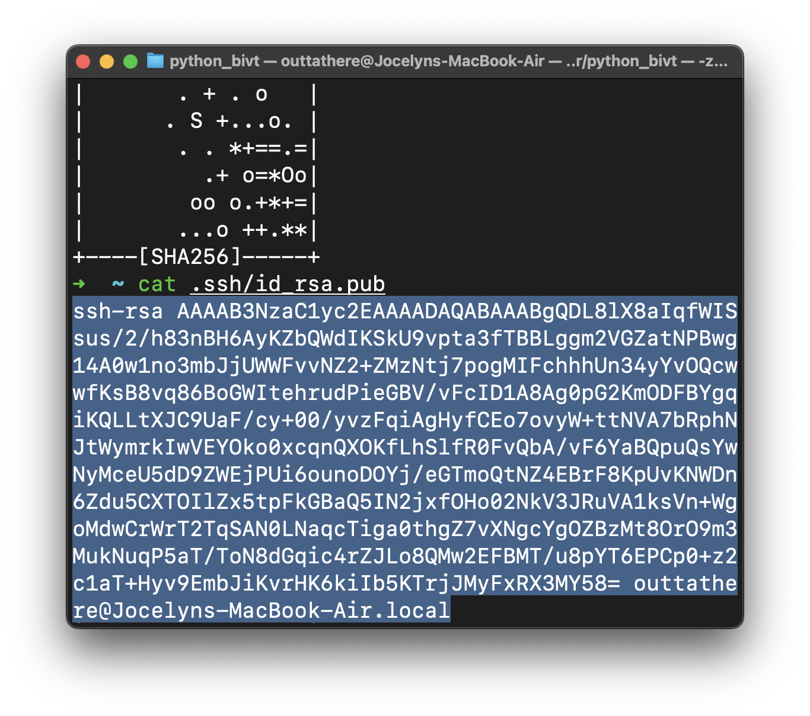
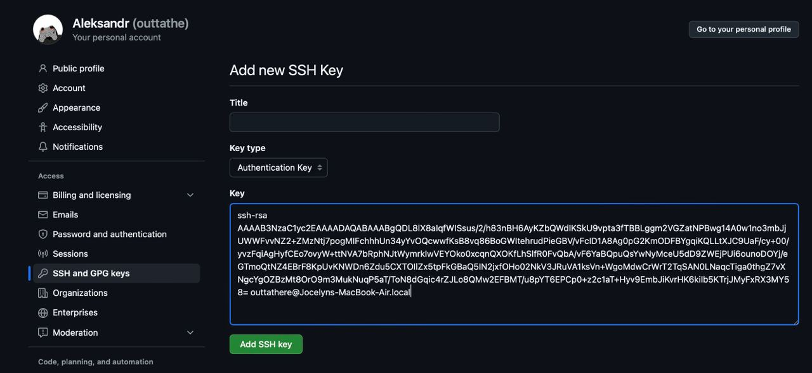
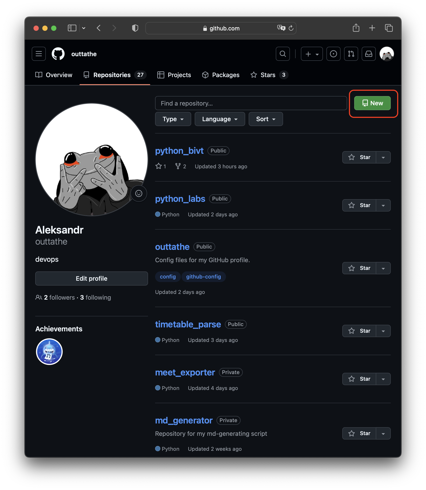
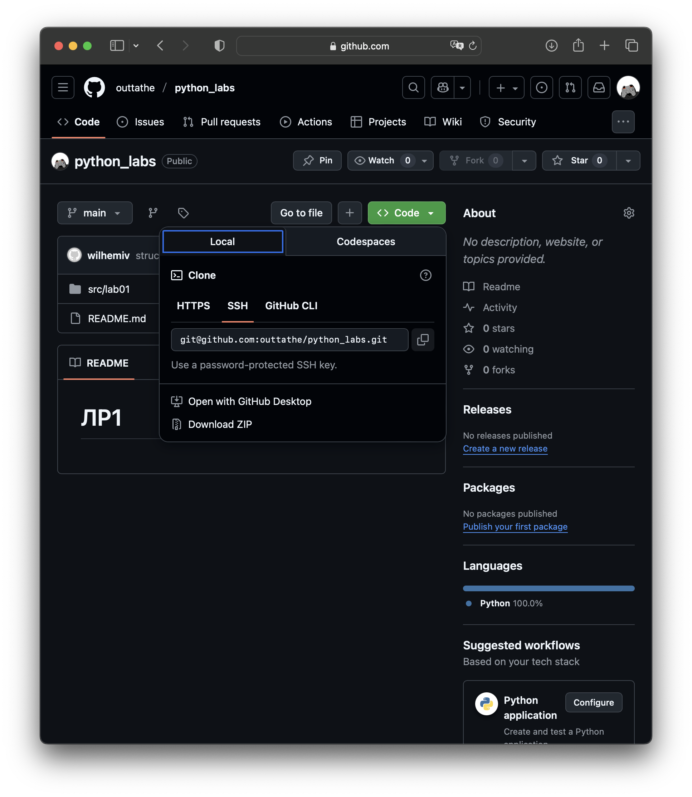

# python_bivt
# Хаб-репозиторий курса (просто и по делу)

В этом репозитории — **правила и ссылки**, а также **задания для лабораторных**.  
Задания ищите тут: `./src/lab01/README.md`, `./src/lab02/README.md`, ...

---

## Что такое Git и система контроля версий (в двух словах)
- **Git** — инструмент для хранения истории кода (кто/что/когда изменил).
- Позволяет **возвращаться** к прошлым версиям, работать **вместе** и делать **ветки** для экспериментов.
- Репозиторий — это папка с историей (`.git`), которую можно хранить на GitHub и на своём компьютере.

## Что нужно сделать?
Для сдачи лабораторных работ Вам понадобится git-репозиторий. Чтобы его создать - необходимо создать аккаунт на github.com и добавить **ssh-ключ**.
## Как создать SSH-ключ (один раз)
Нужен, чтобы отправлять изменения в коде в GitHub-репозиторий без авторизации каждый раз.

**macOS / Linux**
```bash
ssh-keygen -t rsa
# Нажмите Enter 3 раза
cat ~/.ssh/id_rsa.pub
```


**Windows (PowerShell)**
```powershell
ssh-keygen -t rsa
cd .ssh
type id_rsa.pub
```

**Добавьте ключ на GitHub**
GitHub → Settings → **SSH and GPG keys** → **New SSH key** → вставьте содержимое `id_rsa.pub` → Save.  


Копируем содержимое ключа


Заходим в настрйки


Добавляем новый ключ

## Что дальше? Создаем репозиторий.
GitHub → **Repository**

**Repository → New**


**New Repository**→ `python_labs` → Public → Create.


## Как склонировать репозиторий на компьютер

1) На странице репозитория — кнопка **Code** → вкладка **SSH** → скопируйте URL.


2) В терминале:
```bash
cd ~/Desktop
git clone git@github.com:<owner>/<repo>.git
cd <repo>
```



## Где смотреть задания
- Для каждой лабораторной есть папка: `./src/lab01`, `./src/lab02`, ...  
- Внутри — **README.md** с заданием и мини-теорией.