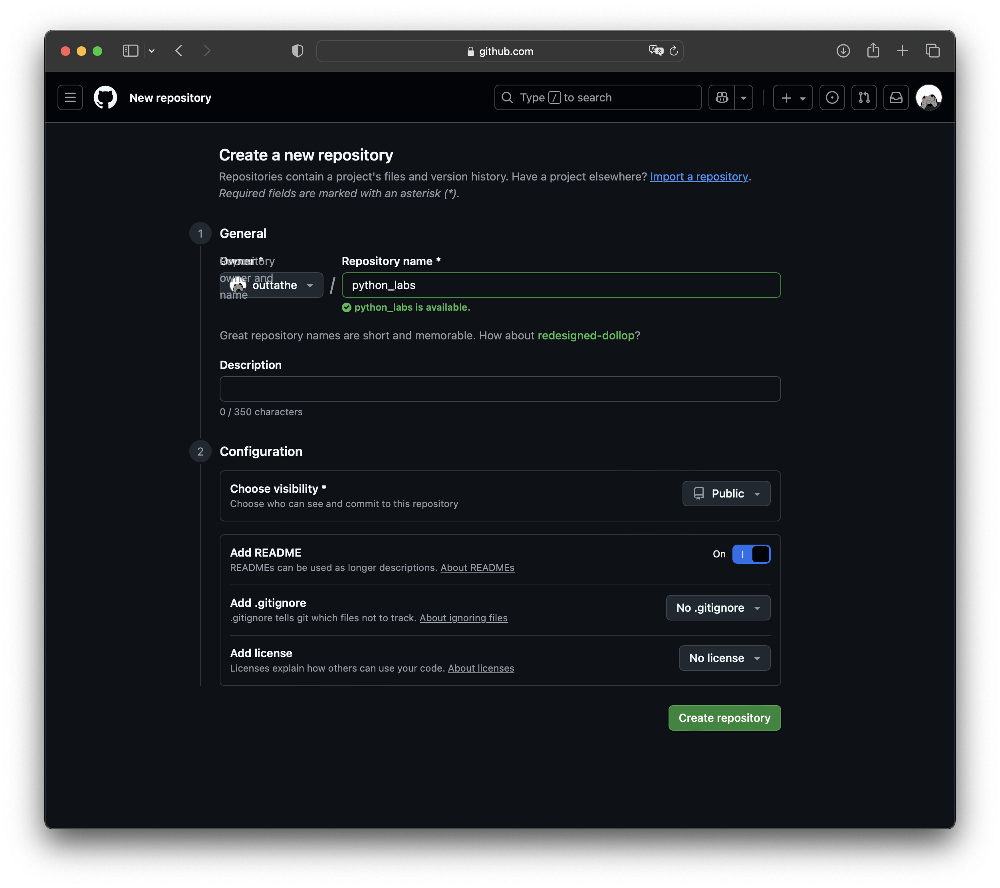
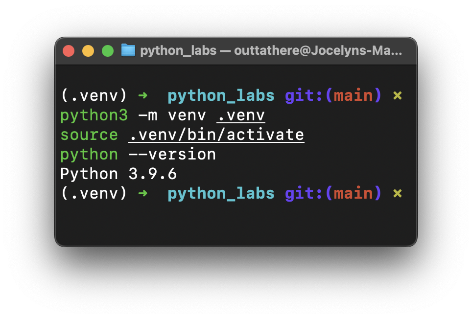
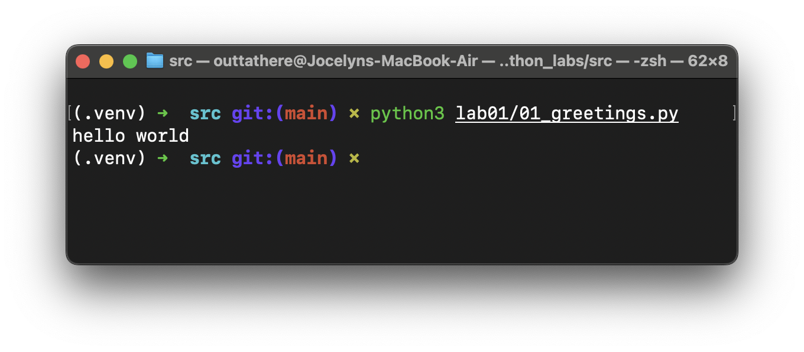

# ЛР1 — Ввод/вывод и форматирование

## Что вы сдаёте
Свой **отдельный репозиторий** на GitHub:
```
python_labs/
├─ README.md           # краткое описание + примеры запуска
├─ src/                # здесь — все скрипты по заданиям
|  ├─ lab01
|  |   ├─ ex01.py
|  |   ├─ ex02.py
|  |   ........
|  |   └─ ex05.py
|  ├─ lab02
|  ........
|  └─ lab10
└─ images/             # сюда — скриншоты работы программ
   ├─ lab01
   |   ├─ img01.png
   |   ........
   |   └─ img05.png
   ├─ lab02
   ........
   └─ lab10
```
## Пошаговый воркфлоу

### 1) Создайте свой репозиторий
GitHub → **New → Repository** → `python_labs` → Public → Create.



### 2) Клонируйте и создайте папки
```bash
git clone git@github.com<nickname>/python_labs.git
cd  python_labs
mkdir -p src images
echo "# ЛР1" > README.md
git add . && git commit -m "init lab01" && git push
```


### 3) Установите VS Code и Python
- VS Code: https://code.visualstudio.com/
- Python 3.11+: https://www.python.org/downloads/

### 4) Создайте виртуальную среду
**macOS / Linux**
```bash
python3 -m venv .venv
source .venv/bin/activate
python --version
```
**Windows (PowerShell)**
```powershell
py -m venv .venv
.venv\Scripts\Activate.ps1
python --version
```


### 5) Где класть файлы и как запускать
- Код — в `src/`, скриншоты — в `images/`.
- Каждый скрипт — отдельный файл для своего задания.
- Запуск:
```bash
python src/01_greeting.py
```


### 6) Как оформить README.md
- Номер задания, скриншот выполнения кода. (скриншоты обязательно подписать) 
- Markdown-шпаргалка: https://www.markdownguide.org/basic-syntax

---

## Задания (5 штук — ввод/вывод, без кода)

### Задание 1 — Привет и возраст
**Файл:** `src/01_greeting.py`  
**Ввод:** имя (строка), возраст (целое).  
**Вывод:** `Привет, <имя>! Через год тебе будет <возраст+1>.`

**Пример:**
```
Имя: Алиса
Возраст: 19
Привет, Алиса! Через год тебе будет 20.
```

---

### Задание 2 — Сумма и среднее
**Файл:** `src/02_sum_avg.py`  
**Ввод:** два числа (вещественные), допускаются **точка или запятая**.  
**Вывод:** `sum=<...>; avg=<...>` — значения печатать **с 2 знаками**.

**Пример:**
```
a: 3,5
b: 4.25
sum=7.75; avg=3.88
```

---

### Задание 3 — Чек: скидка и НДС
**Файл:** `src/03_discount_vat.py`  
**Ввод:** `price` (₽), `discount` (%), `vat` (%) — вещественные.  
**Формулы:**  
`base = price * (1 - discount/100)`  
`vat_amount = base * (vat/100)`  
`total = base + vat_amount`  
**Вывод:** по строкам, **2 знака** после запятой.
```
База после скидки: 900.00 ₽
НДС:               180.00 ₽
Итого к оплате:    1080.00 ₽
```
*(пример входных: price=1000, discount=10, vat=20)*

---

### Задание 4 — Минуты → ЧЧ:ММ
**Файл:** `src/04_minutes_to_hhmm.py`  
**Ввод:** `m` — целые минуты.  
**Вывод:** `ЧЧ:ММ`, минуты печатаем как `:02d`.

**Пример:**
```
Минуты: 135
2:15
```

---

### Задание 5 — Инициалы и длина строки
**Файл:** `src/05_initials_and_len.py`  
**Ввод:** ФИО одной строкой (могут быть лишние пробелы).  
**Вывод:** инициалы (верхний регистр) и длина исходной строки без крайних пробелов.

**Пример:**
```
ФИО:   Иванов   Иван   Иванович  
Инициалы: ИИИ.
Длина (символов): 20
```

---
## Задания со звездочкой

### Задание 6*
На лабораторную работу по проге согласилось прийти много людей. Помогите сосчитать всех участников.

На вход подаётся число `N`, после которой идёт `N` строк, каждая формата
```bash
Фамилия Имя Возраст Формат_участия
```
`Фамилия` и `Имя` представляют из себя строки, когда `Возраст` представляет из себя целое число. `Формат_участия` представляются в виде булевой переменной, где `True` означает очный формат обучения, а `False` - заочный. Вам необходимо посчитать, сколько человек записалось на очный формат и сколько на заочный и вывести два числа через пробел. Пример:
```bash
in_1: 1337
in_2: Максимов Максим 18 True
in_3: Геннадьев Геннадий 17 False
in_4: Алексеев Алексей 17 True
out: 2 1
```

## Задание 7*
При подготовке к лекции кто-то зашифровал все мои материалы. Помогите вернуть исходники.

На вход подаётся строка, состоящая из различных символов без пробелов. Известно, что можно восстановить данные следующим алгоритмом:

1. Первая заглавная буква в строке является первой буквой в оригинальной строке;
2. Символы оригинальной строки расположены в фиксированном шаге друг от друга;
3. Второй символ стоит сразу после цифры;
4. Последним символом оригинальной строки является точка `.`

Напишите алгоритм, по которому можно восстановить оригинальную строку. Пример:
```bash
in: thisisabracadabraHt1eadljjl12ojh.
out: Hello.
```

---

## Что показать на паре
- Репозиторий на GitHub с `src/` и `images/`.
- README со скриншотами.